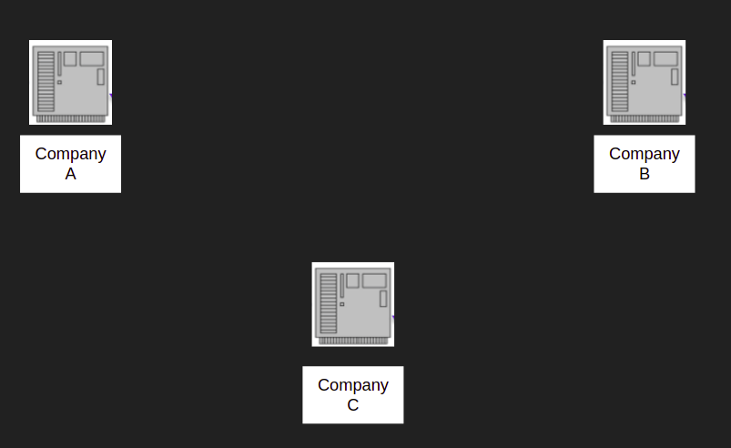
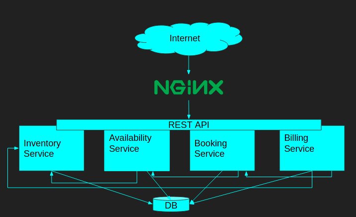

## RESTFul Web Service With Spring

__The goal of this project is to practice and apply concepts learned from the book Building a RESTFul Web Service With Spring by the author Ludovic Dewailly. The design of the Web service I will implement here are taken from his book.__

before getting to the heart of the matter, let me briefly introduce you to what a web service is and what REST and its Principles are all about.

### What is a Web Service ?

Let's imagine that we have three companies that each have a web-based system and each of these systems is implemented with a different programming language.

Let's now imagine the scenario where these three companies become partners and would like to communicate together without changing the implementation of their system.

This is where Web Services come in. A Web Service is an application that allows the communication of several machines through the internet. A web service must guarantee independence from the technologies involved in the communication.
They are two main types of Web Services:
- Simple Object Access Protocol (SOAP): SOAP is an XML-based communication protocol, between devices.
- Representational Stateless Transfer Protocol (REST): REST  a web standard architecture that achieves data communication using a standard protocol such as HTTP or other transfer protocols that use standard Uniform Resource Identifier (URI).
In the remaining of the document we will focus on the REST approach of implementing Web Services since it has become very popular over the last years.

### REST Principle 

before we start with the real implementation of this project let's talk about REST in details and more specificaly its principles.
As mentioned before REST is a software architecture for creating scalable Web Services. The main principles of REST are:

- **Uniform interface**
  Resources are at the core of REST and each resource is identified by a Uniform Resource Identifier([URI](https://en.wikipedia.org/wiki/Uniform_Resource_Identifier)). The format of resource exchange between devices or system is not fixed by the protocol. But the mostly used format are [XML](https://en.wikipedia.org/wiki/XML) and [JSON](https://en.wikipedia.org/wiki/JSON).
  Finally, clients interact entirely through hypermedia, which is dynamically provided by the application servers. The endpoints are the only knowledge that a client need in order to communicate with a RESTFul Service. This constraint is referred as [HATEOAS](https://en.wikipedia.org/wiki/HATEOAS).

- **Client-Server**
  REST embraces the Client-Server Model, which allows the separation of concerns. This decoupling also allow the decoupling in the development process such that the development of the client, and the server can be done completely independently.
  
- **Stateless**
  No client state is stored on the server. That mean each time a client need something form the server he has to tell all that to server in his request. And the server on the other hand will process the request and forget all information received from that client.

- **Cacheable**
  RESTFul web services must provide caching capabilities. That means server can indicate to client how and for how they can cache certain information and used that instead of hitting the server each time need that.

- **Layered system**
  This principle basically means that client are not aware of the server they are communicating with. And this property allows the possibility to introduce new servers, which can act as reverse proxy for example or load balancer.

- **Code on demand**
  This last principle is optional in RESTFul architecture. This principle says that sever can send executable code to clients.

## What We Will Build ?
Now that we have the basic understanding of what Web Services in general, are and what RESTFul Service in particular are lets see what we will build throughout this presentation. 

*The project idea implement here is form the book *[Building a RESTFul Web Service With Spring](https://www.amazon.de/-/en/Ludovic-Dewailly-ebook/dp/B0148S9GV8)*. But this project doesn't use one to one the code presented by the author. In this project we will use modern technique such as conternization with [DOCKER](https://www.docker.com/resources/what-container) to setup our local development and also to illustrate the concept of load balancing with [Nginx](https://www.nginx.com/) and also anonymity using reverse proxy also with [Nginx](https://www.nginx.com/)*

In this project we will build a web service to manage hotels and B&Bs.

our project will have 4 modules as shown in the picture above.

**Project technologies:**
* Springboot : SpringMVC, SpringSecurity, SpringData
* JUnit 5
* Docker : Docker and Docker-compose
* NGINX 
* PostgresSQL
* Gradle for dependencies management

### Support or Contact

Having trouble with Pages? Check out our [documentation](https://docs.github.com/categories/github-pages-basics/) or [contact support](https://support.github.com/contact) and we’ll help you sort it out.
